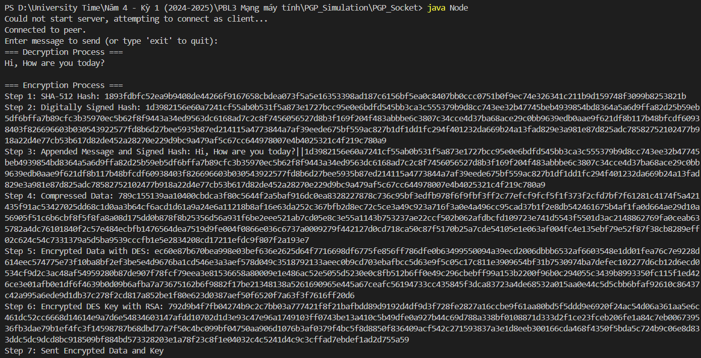
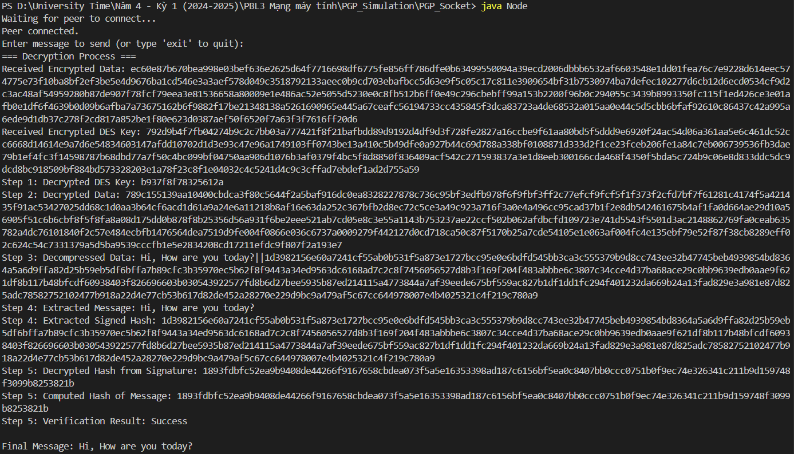

# Pretty Good Privacy Simulation Using Java Socket (P2P)

This program simulates how **Pretty Good Privacy (PGP)** works using Java Socket to securely communicate between two terminals. The encryption and decryption process are displayed in both terminals, allowing users to observe how PGP works in practice.

## Installation

1. **Clone the repository:**
   - Open your terminal or Git Bash.
   - Navigate to the folder where you want to clone the repository.
   - Run the following command:
     ```bash
     git clone https://github.com/NgocHung110/PGP_Simulation
     ```
   - Open the project in Visual Studio Code:
     ```bash
     code .
     ```

## Prerequisites

Before running the project, make sure you have the following installed:

1. **Java Development Kit (JDK)**:
   - Download and install the JDK from [Oracle JDK Downloads](https://www.oracle.com/java/technologies/javase-jdk11-downloads.html).
   - Verify installation by running `java -version` in the terminal.

2. **Visual Studio Code (VSCode)**:
   - Download and install VSCode from [Visual Studio Code Website](https://code.visualstudio.com/).

3. **Java Extension Pack for VSCode**:
   - In VSCode, go to the **Extensions** view (Ctrl+Shift+X).
   - Search for **Extension Pack for Java** and install it.

## Usage

1. **Compile the program:**
   - Open the integrated terminal in VSCode.
   - Compile the Java files by running:
     ```bash
     javac Node.java CryptoUtils.java
     ```

2. **Run the program in two terminals:**
   - Click on the **Terminal** menu in VSCode and select **New Terminal** to open the first terminal.
   - In the first terminal, run the following command:
     ```bash
     java Node
     ```
   - Now, split the terminal by selecting **Split Terminal** or pressing `Ctrl + Shift + 5`.
   - In the second terminal, run the following command:
     ```bash
     java Node
     ```
   - Now, you should be able to communicate between the two terminals and observe how PGP works.

## PGP Process

If you want to discover how PGP works, click the following link to explore the detailed explanation:  
[Process of PGP](https://www.freecodecamp.org/news/understanding-pgp-by-simulating-it-79248891325f/).

## Result

Below are the results after running the simulation on two terminals:

### Encryption Process
The image below shows the encryption process as simulated in the first terminal:



### Decryption Process
The image below shows the decryption process as simulated in the second terminal:



## License

This project is licensed under the MIT License - see the [LICENSE](LICENSE) file for details.
